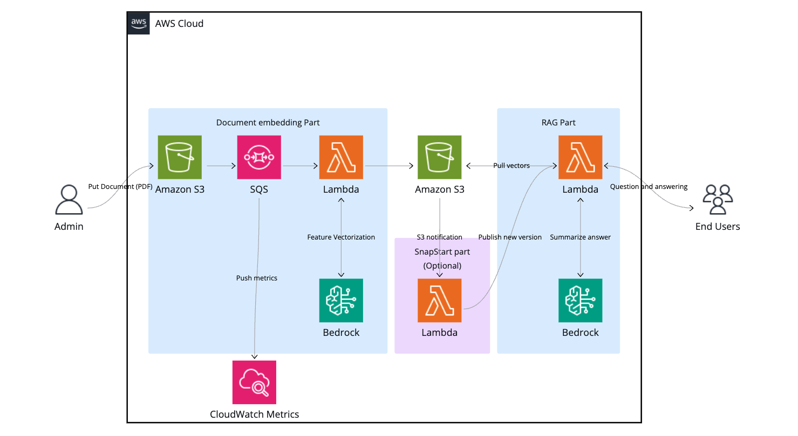

# Serverless RAG
Serverless RAG is an implementation of Retrieval Augumented Generation (RAG) on AWS.
This solution is composed of AWS CDK resources and React project.
Architecture is mainly composed of serverless, event-driven AWS services to deliver RAG experience for uses with low costs.

日本語の説明はこちら
[日本語](./README.ja.md)

## Architecture


## Getting Started
### Prerequisites
- AWS CDK
- Docker
- Node.JS
- Enable following model access on AWS Account
    - Amazon Titan Embed Text V1
    - Claude 3 Haiku

## QuickStart
You can deploy using following commands.
```bash
git clone <this repository>
cd <Project Directory>
cd cdk
npm install
cdk deploy --context createFrontend=true --context generateInitialUser=true --context enableSnapStart=true
```

## Enable Lambda SnapStart
You can deploiy with lambda snapstart option to decrease cold start for improving user experience
```bash
cdk deploy --context enableSnapStart=true
```


## Deploy with Frontend
You can deploy with frontend by setting `createFrontend` context to true.
```bash
git clone <this repository>
cd <Project Directory>
cd cdk
npm install
cdk deploy --context createFrontend=true
```

In addition, you can set up initial user for frontend by setting `generateInitialUser` context to true.
```bash
git clone <this repository>
cd <Project Directory>
cd cdk
npm install
cdk deploy --context createFrontend=true --context generateInitialUser=true
```

You can access the document embedding and search functionality through a GUI by accessing the deployed CloudFront URL.

## Deploy without Frontend

```bash
git clone <this repository>
cd <Project Directory>
cd cdk
npm install
cdk deploy
```

When you put your documents on S3 bucket, S3 qneueue SQS and then Lambda process embedding jobs sequentially.

You can manually invoke Lambda Function as follows.
```bash
aws lambda invoke --function-name <Function Name> \
--cli-binary-format raw-in-base64-out \
--payload '{ "question": "What is EC2 instance?" }' output.txt
```


## Estimated Costs
Estimated costs when this solution is deployed in ap-northeast-1 region are as follows.
> Note: Minor cost items are excluded from the table below.

### 1000 Question answering with RAG costs

| Service               |                                      Item | Total volume | Cost (USD) |
|-----------------------|------------------------------------------:|-------------:|-----------:|
| Lambda(x86, 2GB)      |                         GB-Duration (sec) |     2 * 1000 |    0.03333 |
| Lambda                |                        Number of requests |         1000 |     0.0002 |
| Bedrock               |     Claude 3 Haiku Number of input tokens |  1000 * 1000 |       0.25 |
| Bedrock               |     Claude 3 Haiku Number of output token |   300 * 1000 |      0.375 |
| Total estimated cost  |                                         - |            - |    0.65373 |


### 1 MB documents Embedding costs

| Service               |                                       Item | Total volume | Cost (USD) |
|-----------------------|-------------------------------------------:|-------------:|-----------:|
| Lambda(x86, 4GB)      |                          GB-Duration (sec) |       4 * 20 |     0.0133 |
| Bedrock               |  Amazon Titan Text Embeddings Number of input token amounts | 30000 |  0.006 |
| Total estimated cost	|                                          - |            - |     0.0143 |


### Monthly storage costs

| Service                |                                  Item | Total volume |         Cost (USD) |
|------------------------|--------------------------------------:|-------------:|-------------------:|
| ECR                    |                        Image size(GB) |            1 |                0.1 |
| S3                     |                            Assets(GB) |            1 |              0.025 |

Notes:
- The costs presented are for reference purposes only, as actual costs will vary based on the embedded content and search usage.
- AWS provides a Free Tier offering for select services. These calculations do not include Free Tier benefits; therefore, actual costs may be lower than the estimated amounts shown.
- This cost estimation is based on pricing in the AWS Asia Pacific (Tokyo) Region. In the event of any discrepancy between the prices shown herein and those published on the official AWS website, the pricing on the official AWS website shall prevail.


## Security
See [CONTRIBUTING](./CONTRIBUTING.md) for more information.

## License
This library is licensed under the MIT-0 License. See the [LICENSE](./LICENSE) file.

